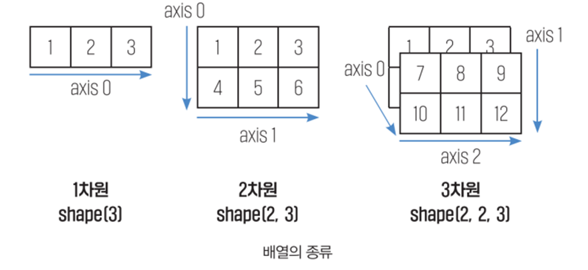
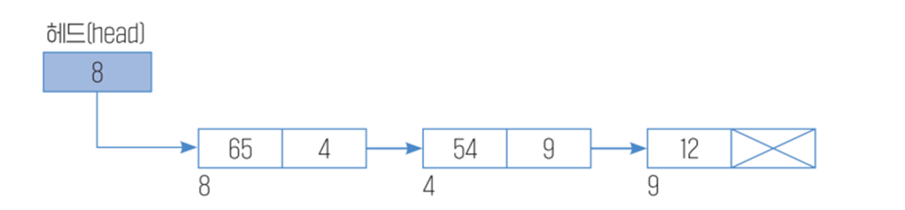
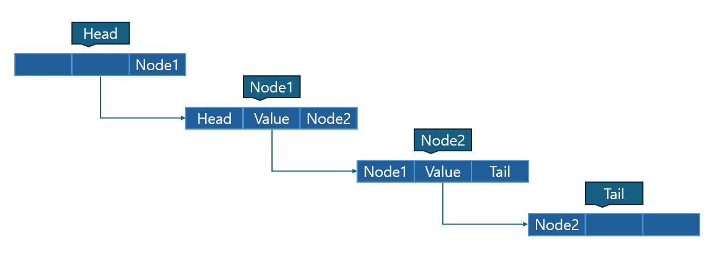

# 자료구조 (Data Structure)

- 컴퓨터에서 데이터를 처리하기 위해 모든 데이터는 메모리에 저장되어야 한다.
- 이때 데이터를 어떻게 저장할지 결정해야 하는 것이 바로 자료 구조이다.
- 자료구조 : 한정된 메모리에서 처리에 필요한 데이터에 효율적으로 접근하기 위한 자료의 조직, 관리, 저장 방법이다.


## 1. 기본 자료구조

- 자료구조의 종류 

  - 선형 자료구조 : **순서가 정해진** 자료구조 

  - 배열(Array),  연결리스트(Linked List), 스택(Stack), 큐(Queue)

    

  - 비선형 자료구조 : **순서가 정해지지 않고 저장**되는 것 

  - 트리(Tree), 그래프(Graph)


> 배열 (Array)
>
> - 인덱스와 인덱스에 대응하는 데이터들로 이루어진 선형 자료구조
> - 순차적으로 데이터를 저장하고 저장된 데이터에 **빠르게 접근**할 수 있다.
> - 파이썬에서는 배열이 제공되지 않고 리스트나 튜플을 사용하여 구현한다.





> 연결 리스트 (Linked List)
>
> - 리스트를 한 줄로 연결하는 방식의 선형 자료구조이다.
> - 연결 리스트의 각 원소들을 **노드(Node)** 라 하고 각 노드는 **데이터**와 **포인터**(다음 노드에 대한 주소) 를 가진다.
> - 처음 시작하는 노드를 **헤드(head)** 라고 한다.


> 단일 연결 리스트 (Single_Linked_List)
>
> - **각 노드가 하나의 다음 노드(next)만을 가리키는** 선형 자료구조
> - **단 방향**으로 다음 노드만을 가진다.
> - **삽입/삭제** 등은 유리하지만 인덱스의 **접근이 느리다.**

```python
# 단일 링크드 리스트의 구조
[10 | o] → [20 | o] → [30 | None]
```





------

## ★(Single Linked List) 클래스의 생성자를 선언하고 메서드들을 구현하기

#### 단일 연결 리스트 변수 설명하기

- 연결 리스트 : 서로 연결된 노드들을 담을 변수  
  - linked_list = {head : [None, None]} 
  -  (※ 일반적인 노드는 node_번호 : [값 , 다음 노드 포인터]  )
- 현재 노드 : 현재 위치하고 있는 노드
  - current_node_name (처음 위치는 보통 head 노드)
- 다음 노드 : 현재 노드의 다음 노드 포인터
  - next_node_name = linked_list[current_node_name] [1]  (※ 0의 경우엔 값을 의미한다. )
- 이전 노드 : 삽입 및 삭제 메서드의 경우 현재 노드 뿐 아니라 주변 노드까지 수정해 주어야하기 때문에 현재 노드를 이전에 담고 현재 노드를 다음 노드로 만들 필요가 있다.
  - prev_node_name
- head_name : head 노드의 이름
- node_nount : 노드의 이름을 지을 때 번호를 부여하기 위한 변수 
- current_position : 딕셔너리 타입인 연결 리스트에 순서 값을 부여하기 위한 변수

```python
# single linked list 자료구조를 클래스로 구현하기

# class 선언
class Single_Linked_List :
    # 생성자 함수
    def __ init __ (self) :
        # 딕셔너리 형태로 연결 리스트 구성
        self.linked_list = {
           'head' : [None, None]
        }
        # head의 노드이름을 변수로 담아준다.
		self.head_name = 'head'
        # 노드의 번호를 부여하기 위한 변수를 만든다.
        self.node_count = 0
```


#### 1) 연결 리스트 안에 새로운 노드를 추가하기 위한 메서드를 만들기.

1. 연결 리스트 안의 가장 마지막 노드를 파악해 준다.

   - 단일 연결 리스트는 단방향이기 때문에 가장 마지막 노드를 파악한 뒤 해당 노드 다음 새로운 노드를 만들어야 한다. 

   - 반복문을 통해 head노드에서 시작하여 연결된 다음 노드로 이동하기를 반복하여 다음 노드 포인터의가 None인 즉, 마지막 노드까지 이동한다.

     

2. 새로운 노드의 이름을 부여하고 연결 리스트 안에 넣어준다.

   - 노드의 이름은 node_count를 'node_' 문자열 뒤에 붙여준다.

   - node_count는 새로운 노드를 추가할 때를 위해 1씩 증가 시킨다.

   - 노드의 값은 [매개변수 value, None]으로 한다. (새롭게 추가한 노드가 마지막 노드가 된다.)

     

3. 원래 마지막 노드의 다음 노드 포인터를 새롭게 만든 노드의 값으로 변환시킨다.

   

```python
	# 연결 리스트 안에 새로운 노드를 만드는 메서드
    def appendData (self, value) :
        # 현재 노드를 head 이름으로 한다.
        current_node_name = self.head_node
     	
        while True :
            # 현재노드의 다음 노드 포인터를 변수로 만들어 준다.
            next_node_name = self.linked_list[current_node_name][1]
            # 현재 노드의 다음 노드 포인터가 없다면 반복을 중단한다.
            if next_node_name == None :
                break
                
            # 현재 노드는 다음 노드 포인터로 한다.
        	current_node_name = next_node_name 
        
        # 새로운 노드 이름 만들기
        new_node_name = f'node_{self.node_count}'
        # 노드 카운트는 이후 새로만들 노드의 이름을 만들기 위해 1씩 증가 시켜준다.
        self.node_count += 1
        
        # 새로운 노드를 연결 리스트에 추가하고 이전 노드의 다음 노드 포인터를 갱신해 준다.
        self.linked_list[new_node_name] = [value, None]
        self.linked_list[current_node_name][1] = new_node_name
```


#### 2) 연결리스트 안 노드의 값들을 출력해서 보여주는 메서드를 만들기.

1. 노드를 순서대로 반복하면서 각 노드의 값을 출력한다.
   - head 노드는 값이 없기 때문에 건너띄도록 설정해 준다.
   - 만약 다음 노드의 포인터가 None 즉, 마지막 노드까지 이동했다면 반복을 중단한다.
   - 현재 노드의 다음 노드가 있다면 현재 노드를 다음 노드 포인터로 한다.


```python
	# 연결 리스트 안 각 노드의 값을 출력해주는 메서드
    def showData (self) :
        # 현재 노드의 이름은 head 이름으로 한다. 
        current_node_name = self.head_name
        
        while True :
            # 현재 노드가 head 노드가 아니면  
            if current_node_name != self.head_name :
                # 현재 노드의 값을 출력해 준다.
                print(self.linked_list[curent_node_name][0])
            
            # 다음 노드 포인터의 이름을 변수로 담아 준다.
            next_node_name = self.linked_list[current_node_name][1]
            # 다음 노드 포인터가 None이라면 즉 현재 노드가 마지막 노드라면 반복을 중단한다.
            if next_node_name == None :
                break
            # 현재 노드를 다음 노드 포인터의 이름으로 한다.
            current_node_name = next_node_name
```


#### 3) 순서 값을 가지고 연결리스트 안 노드의 값을 출력하는 메서드를 만들기.

1. 링크드 리스트안에 head를 제외한 다른 노드가 있는지 확인해 준다.

   - head 노드 밖에 없다면 "저장된 데이터가 없습니다."를 출력하고 메서드를 중단한다.

   - 현재 만든 연결 리스트는 딕셔너리 타입으로 구성되어 있기 때문에 순서 값을 갖지 않는다.

   - 현재 노드의 순서 값을 저장할 변수를 만들어 준다. 

   - head 노드는 순서값을 갖지 않도록 헤드 노드를 다음 노드 포인터로 바꿔준다.

     

2. 반복문을 통해 현재 노드의 순서 값과 매개변수 position의 값이 일치하면 데이터의 값을 출력하도록 만들어 준다.

   - 만약 매개변수 position의 값이 현재 노드의 순서 값보다 큰 값인 경우 문제가 생길 수 있다.
   - 현재 순서 값이 마지막 노드에 도달하면 ''잘못된 순서 값을 입력하였습니다."를 출력한 뒤 반복을 중단하도록 만들어 준다.
   - 현재 노드의 다음 노드 포인터가 있다면 현재 노드를 다음 노드 포인터로 하고 위치 값을 1 증가 시킨 뒤 다음 루프로 넘어간다. 


```python
	# 연결 리스트 안 노드의 순서 값을 통해 해당 노드의 값을 출력하는 메서드
    def getData (self, position) :
      	# 만약 head 노드의 다음 노드 포인터가 None이라면 즉 연결 리스트 내 head 노드 밖에 없다면 
        if self.linked_list[self.head_name][1] == None :
            # 해당 문장을 출력하고 메서드를 끝낸다.
            print('저장된 데이터가 없습니다.')
            return
        # 현재 노드의 이름은 head 노드의 다음 노드 포인터로 한다.
        current_node_name = self.linked_list[self.head_node][1]
        # 현재 노드의 순서 값을 저장해줄 변수를 만든다.
        current_position = 0
        
        while True :
            # 만약 current_position이 매개변수 position과 같다면 
            if current_position == position :
                # 현재 노드의 값을 출력하고 반복을 끝낸다.
                print(f'노드의 값 : {self.linked_list[current_node_name][0]}')
                break
            # 다음 노드의 이름을 변수에 저장한다.
            next_node_name = self.linked_list[current_node_nmae][1]
            
            # 만약 다음 노드의 포인터가 None이라면
            if next_node_name == None :
                print('잘못된 값을 입력하였습니다.')
                break
            # 현재 노드의 순서 값이 아니라면 다음 노드를 현재 노드로 갱신한다.
            current_node_name = next_node_name
            # 다음 위치 값으로 이동한다.
            current_position += 1
```


#### 4) 연결 리스트 안의 노드 사이에 새로운 노드를 삽입하기 위한 메서드를 만들기.

1.  현재 노드를 헤드 노드의 이름으로 하고 생성한 현재 노드의 위치 값을 저장할 변수를 생성한다.

   

2.  반복문을 통해 현재 노드의 위치 값과 입력받은 매개변수 position이 일치할 때 까지 노드를 이동한다.

   - 현재 노드를 이전 노드 변수안에 담은 뒤 현재 노드는 현재 노드의 다음 노드 포인터로 한다.
   - 현재 노드의 위치 값이 매개 변수 position과 일치 한다면 현재 위치에 새로운 노드를 삽입한다. 
   - 이전 노드의 다음 노드 포인터를 새로운 노드의 이름으로 한다.
   - 만약 연결 리스트 내 모든 노드를 확인해도 일치하지 않는다면 "잘못된 위치 값을 입력하였습니다."를 출력한 뒤 반복을 중단한다. 
   - 현재 노드의 다음 노드가 있다면 위치 값을 1 증가 시킨 뒤 다음 루프로 넘어간다.


```python
	# 연결 리스트 안 노드 사이에 새로운 노드를 삽입하는 메서드
    def insertData (self, value, position) :
        # 현재 노드를 head 노드로 한다.
        current_node_name = self.head_name
        # 현재 노드의 순서 값을 저장할 변수를 만든다.
        current_position = 0
        
        while True :
            # 현재 노드를 이전 노드로 하고 현재 노드 이름은 다음 노드 포인터로 한다.
            prev_node_name = current_node_name
            current_node_name = self.linked_list[current_node_name][1]
            
            # 만약 현재 노드의 위치 값이 매개변수 position과 같다면 
            if current_position == position :
                # 해당 위치에 새로운 노드를 삽입한다.
                new_node_name = f'node_{self.node_count}'
                self.linked_list[new_node_name] = [value, current_node_name]
                # 이전 노드의 다음 노드 포인터를 새로운 노드로 바꿔준다.
                self.linked_list[prev_node_name][1] = new_node_name
                break
            
            # 현재 노드의 다음 노드 포인터를 변수로 담아준다.
            next_node_name = self.linked_list[current_node_name][1]
            
            # 만약 현재노드의 다음 노드 포인터가 None이라면 즉 마지막 노드라면
            if next_node_name == None :
                # 해당 문장을 출력하고 반복을 중단한다.
                print('잘못된 위치 값을 입력하였습니다.')
                break
            # 다음 위치 값으로 이동한다.
            current_position += 1
```


#### 5) 연결 리스트 안에 원하는 노드의 값을 수정하기 위한 메서드를 만들기.

1. 연결 리스트 안에 head를 제외한 다른 노드가 있는지 확인한다.

   - 만약 노드 안에 수정할 값이 없다면 "수정할 데이터가 없습니다."를 출력한 뒤 메서드를 끝낸다.

   - head 노드의 다음 노드 포인터로한 변수를 생성한다.

   - 생성한 현재 노드의 위치 값을 저장할 변수를 생성한다.

     

2.  반복문을 통해 현재 노드의 위치 값과 입력받은 매개변수 position이 일치할 때 까지 노드를 이동한다.

   - 만약 위치 값과 position이 일치 한다면 해당 노드의 값을 수정한다.
   - 만약 연결 리스트 내 모든 노드를 확인해도 일치하지 않는다면 "잘못된 위치 값을 입력하였습니다."를 출력한 뒤 반복을 중단한다. 
   - 다음 노드 포인터에 다음 노드 이름이 있다면 현재 노드를 다음 노드 포인터로 하고 순서 값을 1 증가 시킨 뒤 다음 루프로 넘어 간다.


```python
	# 연결 리스트 안에 원하는 노드의 값을 수정하는 메서드
    def setData (self, value, position) :
        # 만약 head 노드의 다음 노드가 None이라면 즉 연결 리스트 안에 head를 제외한 노드가 없다면
        if self.linked_list[self.head_node][1] == None :
        	# 해당 문장을 출력한 뒤 메서드를 끝낸다.
        	print("수정할 데이터가 없습니다.")
            return
        # 현재 노드의 이름을 head 노드의 다음 노드 포인터로 한다.
        current_node_name = self.linked_list[self.head_node][1]
        # 노드의 위치 값을 저장해 줄 변수를 만든다.
        current_position = 0
        
        while True :
            # 만약 현재 노드의 위치 값이 매개변수 position과 같다면  
            if current_position == position :
                # 해당 노드의 값을 수정한 다음 반복을 중단한다.
                self.linked_list[current_node_name][0] = value
                break
            
            # 현재 노드의 다음 노드 포인터를 변수로 담아준다.
            next_node_name = self.linked_list[current_node_name][1]
            
            # 만약 현재노드의 다음 노드 포인터가 None이라면 즉 마지막 노드라면
            if next_node_name == None :
                # 해당 문장을 출력하고 반복을 중단한다.
                print('잘못된 위치 값을 입력하였습니다.')
                break
            # 현재 노드의 순서 값이 아니라면 다음 노드를 현재 노드로 갱신한다.
            current_node_name = next_node_name
            # 다음 위치 값으로 이동한다.
            current_position += 1
```


#### 6) 연결 리스트 안에 원하는 노드의 값을 삭제하기 위한 메서드를 만들기.

1. 연결 리스트 안에 head를 제외한 다른 노드가 있는지 확인한다.

   - 만약 노드 안에 수정할 값이 없다면 "삭제할 데이터가 없습니다."를 출력한 뒤 메서드를 끝낸다.

   - 생성한 현재 노드의 위치 값을 저장할 변수를 생성한다.

     

2.  반복문을 통해 현재 노드의 위치 값과 입력받은 매개변수 position이 일치할 때 까지 노드를 이동한다.

   - 현재 노드를 이전 노드 변수안에 담은 뒤 현재 노드는 현재 노드의 다음 노드 포인터로 한다.
   - 현재 노드의 위치 값이 매개 변수 position과 일치 한다면 이전 노드의 다음 노드 포인터를 현재 노드의 다음 노드 포인터로 하고 현재 노드는 삭제 한다.
   - 만약 연결 리스트 내 모든 노드를 확인해도 일치하지 않는다면 "잘못된 위치 값을 입력하였습니다."를 출력한 뒤 반복을 중단한다. 
   - 현재 노드의 위치 값을 1 증가 시키고 다음 루프로 넘어 간다.


```python
	# 연결 리스트 안에 원하는 노드를 삭제하는 메서드
    def deleteData (self, position):
        # 현재 노드를 head 노드로 한다.
        current_node_name = self.head_name
        
        # 현재 노드의 다음 노드 포인터가 None이라면 
        if self.linked_list[current_node_name][1] == None :
            # 해당 문장을 출력한 뒤 메서드를 끝낸다.
            print('삭제할 데이터가 없습니다.')
            return
        # 노드의 위치 값을 저장해줄 변수를 만든다.
        current_position = 0
        
    	while True :
            # 현재 노드를 이전 노드로 하고 현재 노드 이름은 다음 노드 포인터로 한다.
            prev_node_name = current_node_name
            current_node_name = self.linked_list[current_node_name][1]
            next_node_name = self.linked_list[current_node_name][1]
            # 만약 현재 노드의 위치 값이 매개 변수 position의 값과 같다면
            if current_position == position :
                # 이전 노드의 다음 노드 포인터를 현재 노드의 다음 노드 포인터로 하고 
                # 현재 노드를 삭제 한다.
            	self.linked_list[prev_node_name][1] = next_node_name
                del self.linked_list[current_node_name]
                break
            
            # 만약 현재노드의 다음 노드 포인터가 None이라면 즉 마지막 노드라면
            if next_node_name == None :
                # 해당 문장을 출력하고 반복을 중단한다.
                print('잘못된 위치 값을 입력하였습니다.')
                break
            # 다음 위치 값으로 이동한다.
            current_position += 1            
```

------


> 이중 연결 리스트 (Dubble Linked List)
>
> - 각 노드가 이전 노드 (prev)와 다음 노드 (next) 를 모두 가진 자료 구조이다.
> - 양방향으로 앞, 뒤 모두 참조 가능하다.
> - 중간 삽입 및 삭제가 빠르지만 메모리 사용이 크고 구현이 복잡하다.




## ★(Dubble Linked List) 클래스의 생성자를 선언하고 메서드들을 구현하기

- 연결 리스트 : 서로 연결된 노드들을 담을 변수  
  - linked_list = {head : [None, None, 'tail'], tail : ['head', None, None]}
  - (※ 일반적인 노드는 node_번호 : [이전 노드 포인터, 값 , 다음 노드 포인터] )  
- 현재 노드 : 현재 위치하고 있는 노드
  - current_node_name (처음 위치는 보통 head 노드)
- 다음 노드 : 현재 노드의 다음 노드 포인터 (현재 노드를 다음 노드에 저장하기도 한다 : 삽입 or 삭제)
  - next_node_name = linked_list[current_node_name] [2]  (※ 0의 경우에는 이전 노드, 1의 경우에는 값을 의미한다. )
- 이전 노드 : 현재 노드의 이전 노드 포인터 (현재 노드를 이전 노드에 저장하기도 한다 : 삽입 or 삭제)
  - prev_node_name
- head_name : head 노드의 이름
- node_nount : 노드의 이름을 지을 때 번호를 부여하기 위한 변수 
- current_position : 딕셔너리 타입인 연결 리스트에 순서 값을 부여하기 위한 변수

```python
# dubble linked list 자료구조를 클래스로 구현하기

# class 선언
class Dubble_Linked_List :
    # 생성자 함수
    def __ init __ (self) :
        # 딕셔너리 형태로 연결 리스트 구성
        self.linked_list = {
           'head' : [None, None, 'tail'],
           'tail' : ['head', None, None]
        }
        # head와 tail의 노드이름을 변수로 담아준다.
		self.head_name = 'head'
        self.tail_name = 'tail'
        # 노드의 번호를 부여하기 위한 변수를 만든다.
        self.node_count = 0
```


#### 1) 연결 리스트 안에 새로운 노드를 추가하기 위한 메서드를 만들기.

1. 새로운 노드의 이름을 생성한다.

   - 노드의 이름은 node_count를 'node_' 문자열 뒤에 붙여준다.

   - node_count는 새로운 노드를 추가할 때를 위해 1씩 증가 시킨다.


2. 새로운 노드를 head 뒤(역방향) 와 tail 앞(순방향) 중 어디로 넣을지 선택한다.

   - 이중 연결 리스트의 경우 단일 연결 리스트와 다르게 마지막 노드를 파악할 필요 없이 head 뒤나 tail 앞 중 선택해서 노드를 붙일 수 있다.

   - (딕셔너리는 순서 값을 가지지 않기 때문에 각 노드 마다 다음 노드 포인터만 잘 명시하면 연결이 가능한 것 같다. )
   
   - 역방향으로 추가하는 경우
   
     -  head 노드의 다음 노드 포인터를 변수에 담아준다.
   
     - 새로운 노드를 head 노드 뒤에 넣어준다.
   
     - head 노드의 다음 노드 포인터를 새로운 노드로 한다.
   
     - head 노드의 원래 다음 노드 포인터의 이전 노드 포인터를 새로운 노드로 한다. 
   
     
   
   - 순방향으로 추가하는 경우
   
     - tail 노드의 이전 노드 포인터를 변수에 담아준다.
   
   
     - 새로운 노드를 tail 노드 앞에 넣어준다.
   
     - tail 노드의 이전 노드 포인터를 새로운 노드로 한다.
   
     - tail 노드의 원래 이전 노드 포인터의 다음 노드 포인터를 새로운 노드로 한다. 
   
     
   
     

```python
	# 연결 리스트 안에 노드를 추가하기 위한 메서드
    def appendData (self, value, head_or_tail = 1) :
        # 새로운 노드의 이름을 만들어 준다.
        new_node_name = f'node_{self.node_count}'
        # 노드 카운트는 이후 새로만들 노드의 이름을 만들기 위해 1씩 증가 시켜준다.
        self.node_count += 1
        
        # 역방향의 경우 (head 뒤) 
        if head_or_tail == 0 :
            # head 노드의 다음 노드 포인터를 변수에 담아준다.
            next_node_name = self.linked_list[self.head_name][2]
            # 새로운 노드를 head 노드 뒤에 넣어준다. 
            # 새로운 노드의 값은 [head 노드, 매개변수 value, head 노드의 다음 노드 포인터]
            self.linked_list[new_node_name] = [self.head_name, value, next_node_name]
            # head 노드의 다음 노드 포인터를 새로운 노드 이름으로 한다.
            self.linked_list[self.head_name][2] = new_node_name
            # head 노드의 원래 다음 노드 포인터의 이전 노드 포인터를 새로운 노드로 한다.
            self.linked_list[self.next_node_name][0] = new_node_name
        
        # 순방향의 경우 (tail 앞)
        if head_or_tail == 1 :
            # tail 노드의 이전 노드 포인터를 변수에 담아준다.
            prev_node_name = self.linked_list[self.tail_name][0]
            # 새로운 노드를 tail 노드 앞에 넣어준다.
            # 새로운 노드의 값은 [tail의 이전 노드의 포인터, 매개변수 value, tail 노드]
            self.linked_list[new_node_name] = [prev_node_name, value, self.tail_name]
            # tail 노드의 이전 노드 포인터를 새로운 노드 이름으로 한다.
            self.linked_list[self.tail_name][0] = new_node_name
            # tail 노드의 원래 이전 노드 포인터의 다음 노드 포인터를 새로운 노드로 한다.
            self.linked_list[self.prev_node_name][2] = new_node_name
         
```


#### 2) 연결 리스트 안에 모든 노드의 값을 출력하기 위한 메서드를 만들기

1. 노드의 출력을 순방향으로 할지 역방향으로 할지 선택한다.

   - 순방향 : 단일 연결 리스트와 마찬가지로 head 뒤에서 부터 하나씩 출력해서 tail 앞에서 멈춘다.
   - 역방향 : tail의 앞에서 출력해서 head 뒤에서 멈춘다.

   

2. 현재 노드가 head 또는 tail이 아니라면 현재 노드의 값을 출력한다.


3. 만약 다음 또는 이전 노드가 head 또는 tail 이라면 (※ 진행 방향의 다음 노드가 마지막 노드라면) 반복을 중단한다.
   - 다른 노드가 있는 경우 현재 노드가 순방향이라면 다음 노드 포인터로 역방향이라면 이전 노드 포인터로 한 뒤 다음 루프로 넘어간다.


```python
	# 연결 리스트 안에 모든 노드를 출력하는 메서드
    def showData (self, head_or_tail = 1) :
        # 순방향의 경우 (head 뒤에서 부터 tail 앞 까지 출력)
        if head_or_tail == 1 :
            # 현재 노드를 head 노드부터 시작한다.
            current_node_name = self.head_name
        
        while True : 
            # 만약 현재 노드가 head 노드가 아니라면 현재 노드의 값을 출력하도록 한다.
            if current_node_name != self.head_name :
                print(self.linked_list[current_node_name][1])
            
            # 현재 노드의 다음 노드 포인터를 변수에 담아준다.
            next_node_name = self.linked_list[current_node_name][2]
            # 만약 현재 노드의 다음 노드 포인터가 tail 노드라면 반복을 중단한다.
            if next_node_name = self.tail_name :
                break
            # 현재 노드 이름을 다음 노드 포인터로 한다.
            current_node_name = next_node_name
            
    	# 역방향의 경우 (tail의 앞에서 부터 head 뒤 까지 출력)    
    	elif head_or_tail == 0 :
        	# 현재 노드를 tail 노드부터 시작한다.
            current_node_name = self.tail_name
            
        while True :    
            # 만약 현재 노드가 tail 노드가 아니라면 현재 노드의 값을 출력하도록 한다.
            if current_node_name != self.tail_name :
                print(self.linked_list[current_node_name][1])
            
            # 현재 노드의 이전 노드 포인터를 변수에 담아준다.
            prev_node_name = self.linked_list[current_node_name][0]
            # 만약 현재 노드의 이전 노드 포인터가 head 노드라면 반복을 중단한다.
            if prev_node_name = self.head_name :
                break
            # 현재 노드의 이름을 이전 노드 포인터로 한다.
            current_node_name = prev_node_name
```


#### 3) 순서 값을 가지고 연결리스트 안 노드의 값을 출력하는 메서드를 만들기.

1. 이전 또는 다음 노드 포인터로 이동할 때 순방향으로 할지 역방향으로 할지 선택한다.

   - 순방향 : head 뒤에서 부터 순서 값을 부여하며 이동. tail 앞에서 멈춘다.

   - 역방향 : tail의 앞에서 부터  순서 값을 부여하며 이동. head 뒤에서 멈춘다.

     

2.  순방향인 경우 head 노드로 역방향인 경우 tail 노드에서 코드를 진행한다.

   - 만약 연결 리스트 안에 head노드와 tail노드를 제외한 다른 노드가 없다면 메서드를 끝낸다.
   - 순방향 : head 노드의 다음 노드 포인터를 현재 노드에 담은 뒤 head 바로 다음 노드를 시작으로 위치 값을 변수로 저장해 준다. 

   - 역방향 : tail 노드의 이전 노드 포인터를 현재 노드에 담은 뒤 tail 바로 이전 노드를 시작으로 위치 값을 변수에 저장해 준다.

   

3.  현재 노드의 위치 값이 매개 변수 position과 일치 한다면 현재 노드를 출력해 준다.


4. 현재 순방향 또는 역방향으로 이동하는 노드가 마지막 노드 (head 노드 또는 tail 노드 바로 전/후) 까지 도달했다면 반복을 중단한다.
   -  (노드의 순서 값 보다 큰 값이 들어오는 경우 반복을 중단하기 위한 문장)
   - 마지막 노드가 아닌 경우 현재 노드를 이전 또는 다음 노드로 하고 순서 값을 1 증가 시켜준 뒤 다음 루프로 넘어간다.

```python
	# 연결 리스트 안 노드의 순서 값을 통해 해당 노드의 값을 출력하는 메서드
    def getData (self, position, head_or_tail = 1) :
        
      	# 순방향의 경우 (head 뒤에서 부터 tail 앞 까지 이동) 
        if head_or_tail == 1 :
            # 만약 head의 다음 노드가 tail인 경우 즉, 연결 리스트 내 다른 노드가 없다면
            if self.linked_list[self.head_name][2] == self.tail_name :
                # 해당 문장을 출력한 뒤 메서드를 끝낸다.
                print("저장된 데이터가 없습니다.")
                return
            # 현재 노드의 이름은 head 노드의 다음 노드 포인터로 한다.
            current_node_name = self.head_name
            # 현재 노드의 위치 값을 저장해줄 변수를 선언한다.
            current_position = 0
        
        	while True :
                # 만약 현재 노드의 위치 값과 매개변수 position이 같다면 
                if current_position == position :
                    # 현재 노드의 값을 출력해 준 뒤 반복을 끝낸다.
                    print(f'해당 위치의 값 : {self.linked_list[current_node_name][1]}')
                    break
                # 현재 노드의 다음 노드 포인터를 변수에 담아준다.
                next_node_name = self.linked_list[current_node_name][2]

                # 만약 다음 노드 포인터가 tail 노드 라면
                if next_node_name == self.tail_name :
                    # 해당 문장을 출력한 뒤 반복을 끝낸다.
                    print('잘못된 순서 값을 입력하였습니다.')
                    break
                # 현재 노드는 다음 노드 포인터로 한다.
                current_node_name = next_node_name
                # 현재 노드의 위치 값을 1 증가 시킨다. (다음 노드 포인터의 위치 값)
                current_position += 1
                
        # 역방향의 경우 (tail 앞에서 부터 head 뒤 까지 이동)
        elif head_or_tail == 0 :
        	# 만약 tail 노드의 이전 노드 포인터가 head 노드라면 
        	# 즉 연결 리스트 안에 head 노드와 tail 노드 뿐이라면
            if self.linked_list[self.tail_name][0] == self.head_name :
                # 해당 문장을 출력한 뒤 메서드를 끝낸다.
                print('저장된 데이터가 없습니다.')
                return
                
            # 현재 노드의 이름을 tail 노드의 이전 노드 포인터로 한다.
            current_node_name = self.linked_list[self.tail_name][0]
            # 현재 노드의 위치 값을 저장하기 위한 변수를 만든다.
            current_position = 0
                
            while True :
                # 만약 해당 현재 노드의 위치 값과 매개 변수 value가 일치한다면
                if current_position == position :
                    # 현재 노드의 값을 출력한 뒤 반복을 끝낸다.
                    print(f'해당 위치의 값 : {self.linked_list[current_node_name][1]}')
                    break
                    
                # 현재 노드의 이전 노드 포인터를 변수에 담아준다.
                prev_node_name = self.linked_list[current_node_name][0]
                    
                # 만약 현재 노드의 이전 노드 포인터가 head 노드라면
                if prev_node_name == self.head_name :
                    # 해당 문장을 출력한 뒤 반복을 끝낸다.
                    print('잘못 된 위치 값을 입력하였습니다.')
                    break
                # 현재 노드는 이전 노드 포인터로 한다.
                current_node_name = prev_node_name
                # 현재 노드의 위치 값을 1증가 시킨다.
                current_position += 1
```


#### 4) 연결 리스트 안의 노드 사이에 새로운 노드를 삽입하기 위한 메서드를 만들기.

1.  이전 또는 다음 노드 포인터로 이동할 때 순방향으로 할지 역방향으로 할지 선택한다.

   - 순방향 : head 뒤에서 부터 순서 값을 부여하며 이동한다. tail 앞에서 멈춘다.

   - 역방향 : tail의 앞에서 부터  순서 값을 부여하며 이동한다. head 뒤에서 멈춘다.

     

2. 순방향의 경우 head 노드로 역방향의 경우 tail 노드를 현재 노드로 시작한다.

   -  현재 노드의 순서 값을 저장하기 위한 변수를 만들어 준다.


3.  순방향의 경우 현재 노드를 이전 노드에 담은 뒤 다음 노드 포인터를 현재 노드로 하고 역방향의 경우엔 현재 노드를 다음 노드에 담은 뒤 이전 노드 포인터를 현재 노드로 한다.

   

4. 만약 현재 노드의 순서 값이 매개 변수 position과 같다면 해당 위치에 새로운 노드를 삽입해 준다.

   - 새로운 노드 이름을 변수에 담는다. ( 새로운 노드 : node_ + self.node_count )

   - 다른 노드들 사이의 중간 위치에 새로운 노드를 삽입할 경우 해당 위치 전후에 있는 포인터들도 같이 수정해 줘야 한다.
   - 순방향 : 새로운 노드의 이전에 있는 head 노드의 다음 노드 포인터는 새로운 노드로 하고 새로운 노드 다음에 있는 노드의 이전 노드 포인터도 새로운 노드로 한다.
   - 역방향 : 새로운 노드의 이후에 있는 tail 노드의 이전 노드 포인터는 새로운 노드로 하고 새로운 노드 다음에 있는 노드의 다음 노드 포인터도 새로운 노드로 한다.


5. 현재 순방향 또는 역방향으로 이동하는 노드가 마지막 노드 (head 노드 또는 tail 노드 바로 전/후) 까지 도달했다면 반복을 중단한다.
   -  (노드의 순서 값 보다 큰 값이 들어오는 경우 반복을 중단하기 위한 문장)
   -  순서 값을 1 증가 시키고 다음 루프로 넘어간다.


```python
	# 연결 리스트 안에 노드 사이 새로운 노드를 삽입하는 메서드
    def insertData (self, value, position, head_or_tail = 1)
    
        # 순방향의 경우 (head 뒤에서 부터 tail 앞 까지 이동) 
        if head_or_tail == 1 :
            # 현재 노드의 이름을 헤드 노드로 한다.
            current_node_name = self.head_name
            # 현재 노드의 위치 값을 저장하기 위한 변수를 만든다.
            current_position = 0

            while True :
                # 현재 노드를 이전 노드 변수에 담아준다.
                prev_node_name = current_node_name
                # 현재 노드를 다음 노드 포인터로 한다.
                current_node_name = self.linked_list[current_node_name][2]

                # 만약 현재 노드의 위치 값과 매개 변수 position이 일치한다면
                if current_position == position :
                    # 새로운 노드를 만들어 현재 위치에 넣어준다.
                    new_node_name = f'node_{self.node_count}'
                    # 새로운 노드의 값 : [이전 노드의 이름, 매개변수 value, 현재 노드의 이름]
                    self.linked_list[new_node_name] = [prev_node_name, value, current_node_name]
                    # 이전 노드의 다음 노드 포인터를 새로운 노드로 한다.
                    self.linked_list[prev_node_name][2] = new_node_name 
                    # 현재 노드의 이전 노드 포인터를 새로운 노드로 한다.
                    self.linked_list[current_node_name][0] = new_node_name
                    break

                # 만약 현재 노드의 다음 노드 포인터가 tail 노드라면
                if self.linked_list[current_node_name][2] == self.tail_name :
                    # 해당 문장을 출력한 뒤 반복을 끝낸다.
                    print('잘못된 순서 값을 입력하였습니다.')
                    break

                # 현재 노드의 위치 값을 1증가 시킨다.
                current_position += 1

        # 역방향의 경우 (tail 앞에서 부터 head 뒤 까지 이동)
        elif head_or_tail == 0
            # 현재 노드의 이름을 tail 노드로 한다.
            current_node_name = self.tail_name
            # 현재 노드의 위치 값을 저장하기 위한 변수를 만든다.
            current_position = 0

            while True :
                # 현재 노드를 다음 노드 변수에 담아준다.
                next_node_name = current_node_name
                # 현재 노드를 이전 노드 포인터로 한다.
                current_node_name = self.linked_list[current_node_name][0]

                # 만약 현재 노드의 위치 값과 매개 변수 position이 일치한다면
                if current_position == position :
                    # 새로운 노드를 만들어 현재 위치에 넣어준다.
                    new_node_name = f'node_{self.node_count}'
                    # 새로운 노드의 값 : [현재 노드의 이름 ,매개변수 value, 다음 노드의 이름]
                    self.linked_list[new_node_name] = [current_node_name, value, next_node_name]
                    # 다음 노드의 이전 노드 포인터를 새로운 노드로 한다.
                    self.linked_list[next_node_name][0] = new_node_name 
                    # 현재 노드의 다음 노드 포인터를 새로운 노드로 한다.
                    self.linked_list[current_node_name][2] = new_node_name
                    break

                # 만약 현재 노드의 이전 노드 포인터가 head 노드라면
                if self.linked_list[current_node_name][0] == self.head_name :
                    # 해당 문장을 출력한 뒤 반복을 끝낸다.
                    print('잘못된 순서 값을 입력하였습니다.')
                    break

                # 현재 노드의 위치 값을 1증가 시킨다.
                current_position += 1
```


#### 5) 연결리스트 안 노드의 사이의 값을 수정하는 메서드를 만들기.

1. 이전 또는 다음 노드 포인터로 이동할 때 순방향으로 할지 역방향으로 할지 선택한다.

   - 순방향 : head 뒤에서 부터 순서 값을 부여하며 이동. tail 앞에서 멈춘다.

   - 역방향 : tail의 앞에서 부터  순서 값을 부여하며 이동. head 뒤에서 멈춘다.

     

2.  순방향인 경우 head 노드로 역방향인 경우 tail 노드에서 코드를 진행한다.

   - 만약 연결 리스트 안에 head노드와 tail노드를 제외한 다른 노드가 없다면 메서드를 끝낸다.
   - 순방향 : head 노드의 다음 노드 포인터를 현재 노드에 담은 뒤 head 바로 다음 노드를 시작으로 위치 값을 변수로 저장해 준다. 

   - 역방향 : tail 노드의 이전 노드 포인터를 현재 노드에 담은 뒤 tail 바로 이전 노드를 시작으로 위치 값을 변수에 저장해 준다.

   

3.  현재 노드의 위치 값이 매개 변수 position와 일치 한다면 현재 노드의 값을 value로 변경한다.


4. 현재 순방향 또는 역방향으로 이동하는 노드가 마지막 노드 (head 노드 또는 tail 노드 바로 전/후) 까지 도달했다면 반복을 중단한다.
   -  (노드의 순서 값 보다 큰 값이 들어오는 경우 반복을 중단하기 위한 문장)
   - 마지막 노드가 아닌 경우 현재 노드를 이전 또는 다음 노드로 하고 순서 값을 1 증가 시켜준 뒤 다음 루프로 넘어간다.


```python
	# 연결 리스트 안에 원하는 노드의 값을 수정하는 메서드
    def setData (self, value, position, head_or_tail = 1) :
            
      	# 순방향의 경우 (head 뒤에서 부터 tail 앞 까지 이동) 
        if head_or_tail == 1 :
            # 만약 head의 다음 노드가 tail인 경우 즉, 연결 리스트 내 다른 노드가 없다면
            if self.linked_list[self.head_name][2] == self.tail_name :
                # 해당 문장을 출력한 뒤 메서드를 끝낸다.
                print("수정할 데이터가 없습니다.")
                return
            # 현재 노드의 이름은 head 노드의 다음 노드 포인터로 한다.
            current_node_name = self.head_name
            # 현재 노드의 위치 값을 저장해줄 변수를 선언한다.
            current_position = 0
        
        	while True :
                # 만약 현재 노드의 위치 값과 매개변수 position이 같다면 
                if current_position == position :
                    # 현재 노드의 값을 매개변수 value로 변환한 뒤 반복을 끝낸다.
                    self.linked_list[current_node_name][1] = value
                    break
                # 현재 노드의 다음 노드 포인터를 변수에 담아준다.
                next_node_name = self.linked_list[current_node_name][2]

                # 만약 다음 노드 포인터가 tail 노드 라면
                if next_node_name == self.tail_name :
                    # 해당 문장을 출력한 뒤 반복을 끝낸다.
                    print('잘못된 순서 값을 입력하였습니다.')
                    break
                    
                # 현재 노드는 다음 노드 포인터로 한다.
                current_node_name = next_node_name
                # 현재 노드의 위치 값을 1 증가 시킨다. (다음 노드 포인터의 위치 값)
                current_position += 1
                
        # 역방향의 경우 (tail 앞에서 부터 head 뒤 까지 이동)
        elif head_or_tail == 0 :
        	# 만약 tail 노드의 이전 노드 포인터가 head 노드라면 
        	# 즉 연결 리스트 안에 head 노드와 tail 노드 뿐이라면
            if self.linked_list[self.tail_name][0] == self.head_name :
                # 해당 문장을 출력한 뒤 메서드를 끝낸다.
                print('수정할 데이터가 없습니다.')
                return
                
            # 현재 노드의 이름을 tail 노드의 이전 노드 포인터로 한다.
            current_node_name = self.linked_list[self.tail_name][0]
            # 현재 노드의 위치 값을 저장하기 위한 변수를 만든다.
            current_position = 0
                
            while True :
                # 만약 해당 현재 노드의 위치 값과 매개 변수 value가 일치한다면
                if current_position == position :
                    # 현재 노드의 값을 매개 변수 value로 변환한 뒤 반복을 끝낸다.
                    self.linked_list[current_node_name][1] = value
                    break
                    
                # 현재 노드의 이전 노드 포인터를 변수에 담아준다.
                prev_node_name = self.linked_list[current_node_name][0]
                    
                # 만약 현재 노드의 이전 노드 포인터가 head 노드라면
                if prev_node_name == self.head_name :
                    # 해당 문장을 출력한 뒤 반복을 끝낸다.
                    print('잘못 된 위치 값을 입력하였습니다.')
                    break
                # 현재 노드는 이전 노드 포인터로 한다.
                current_node_name = prev_node_name
                # 현재 노드의 위치 값을 1증가 시킨다.
                current_position += 1  
```


#### 6) 연결 리스트 안의 선택한 노드를 삭제하기 위한 메서드를 만들기.

1.  이전 또는 다음 노드 포인터로 이동할 때 순방향으로 할지 역방향으로 할지 선택한다.

   - 순방향 : head 뒤에서 부터 순서 값을 부여하며 이동한다. tail 앞에서 멈춘다.

   - 역방향 : tail의 앞에서 부터  순서 값을 부여하며 이동한다. head 뒤에서 멈춘다.

     

2. 순방향의 경우 head노드의 다음 노드가 tail인지 확인하고 역방향의 경우 tail노드의 이전 노드가 head인지 확인한다.

   - 연결 리스트 안에 head노드와 tail노드를 제외한 다른 노드가 있는지 확인한다.

   - 만약 없다면 메서드를 중단하도록 한다.

     

3. 순방향의 경우 head 노드로 역방향의 경우 tail 노드를 현재 노드로 시작한다.

   -  현재 노드의 순서 값을 저장하기 위한 변수를 만들어 준다.


3.  순방향의 경우 현재 노드를 이전 노드로 하고 현재 노드를 다음 노드 포인터로 하는 변수를 만들어 주고 역방향의 경우 현재 노드를 다음 노드로 하고 현재 노드를 이전 노드 포인터로 하는 변수를 만들어 준다. 

   - (이전 : 현재, 현재 : 현재의 다음, 다음: 다음의 다음)

   

4. 만약 현재 노드의 순서 값이 매개 변수 position과 같다면 해당 위치에 노드를 삭제한다.

   - 노드를 삭제하기 전 현재 노드의 주변 노드를 수정해 주어야 한다.

   - 순방향 :  이전 노드의 다음 노드를 현재 노드의 다음 노드 포인터로 하고 그 다음 노드 포인터의 이전 노드 포인터를 이전 노드로 한다.
   - 역방향 : 다음 노드의 이전 노드를 현재 노드의 이전 노드 포인터로 하고 그 이전 노드 포인터의 다음 노드 포인터를 다음 노드로 한다.


5. 현재 순방향 또는 역방향으로 이동하는 노드가 마지막 노드 (head 노드 또는 tail 노드 바로 전/후) 까지 도달했다면 반복을 중단한다.
   -  (노드의 순서 값 보다 큰 값이 들어오는 경우 반복을 중단하기 위한 문장)
   -  순서 값을 1 증가 시키고 다음 루프로 넘어간다.

```python
	# 연결 리스트 안에서 선택한 노드 삭제하는 메서드
    def.deleteData (self, position, head_or_tail = 1)
        
        # 순방향의 경우 (head 뒤에서 부터 tail 앞 까지 이동) 
        if head_or_tail == 1 :
            # 만약 head 노드의 다음 노드가 tail인 경우 즉, 연결 리스트 내 다른 노드가 없다면
            if self.linked_list[self.head_name][2] == self.tail_name :
                # 해당 문장을 출력한 뒤 메서드를 끝낸다.
                print("삭제할 데이터가 없습니다.")
                return
            # 현재 노드의 이름을 head 노드로 한다.
            current_node_name = self.head_name
            # 현재 노드의 위치 값을 저장하기 위한 변수를 만든다.
            current_position = 0

            while True :
                
                # 이전 노드 변수에 현재 노드를 담아준다.
                prev_node_name = current_node_name
                # 현재 노드를 다음 노드 포인터로 한다.
                current_node_name = self.linked_list[current_node_name][2]
				# 현재 노드의 다음 노드 포인터를 변수에 담아 준다.
                next_node_name = self.linked_list[current_node_name][2]
                
                # 만약 현재 노드의 위치 값과 매개 변수 position이 일치한다면
                if current_position == position :
                    # 이전 노드의 다음 노드 포인터를 현재 노드의 다음 노드 포인터로 바꿔준다.
                    self.linked_list[prev_node_name][2] = next_node_name
                    # 다음 노드의 이전 노드 포인터를 이전 노드로 바꿔준다.
                    self.linked_list[next_node_name][0] = prev_node_name
                    # 현재 노드를 삭제한 후 반복을 중단한다.
                    del self.linked_list[current_node_name]
                    break


                # 만약 현재 노드의 다음 노드 포인터가 tail 노드라면
                if self.linked_list[current_node_name][2] == self.tail_name :
                    # 해당 문장을 출력한 뒤 반복을 끝낸다.
                    print('잘못된 순서 값을 입력하였습니다.')
                    break

                # 현재 노드의 위치 값을 1증가 시킨다.
                current_position += 1

        # 역방향의 경우 (tail 앞에서 부터 head 뒤 까지 이동)
        if head_or_tail == 0 :
            # 만약 tail 노드의 이전 노드가 head 노드인 경우 즉, 연결 리스트 내 다른 노드가 없다면
            if self.linked_list[self.tail_name][0] == self.head_name :
                # 해당 문장을 출력한 뒤 메서드를 끝낸다.
                print("삭제할 데이터가 없습니다.")
                return
            # 현재 노드의 이름을 tail 노드로 한다.
            current_node_name = self.tail_name
            # 현재 노드의 위치 값을 저장하기 위한 변수를 만든다.
            current_position = 0

            while True :
                
                # 다음 노드 변수에 현재 노드를 담아준다.
                next_node_name = current_node_name
                # 현재 노드를 이전 노드 포인터로 한다.
                current_node_name = self.linked_list[current_node_name][0]
				# 현재 노드의 이전 노드 포인터를 변수에 담아 준다.
                prev_node_name = self.linked_list[current_node_name][0]
                
                # 만약 현재 노드의 위치 값과 매개 변수 position이 일치한다면
                if current_position == position :
                    # 다음 노드의 이전 노드 포인터를 현재 노드의 이전 노드 포인터로 바꿔준다.
                    self.linked_list[next_node_name][0] = prev_node_name
                    # 이전 노드의 다음 노드 포인터를 다음 노드로 바꿔준다.
                    self.linked_list[prev_node_name][2] = next_node_name
                    # 현재 노드를 삭제한 후 반복을 중단한다.
                    del self.linked_list[current_node_name]
                    break


                # 만약 현재 노드의 이전 노드 포인터가 head 노드라면
                if self.linked_list[current_node_name][0] == self.head_name :
                    # 해당 문장을 출력한 뒤 반복을 끝낸다.
                    print('잘못된 순서 값을 입력하였습니다.')
                    break

                # 현재 노드의 위치 값을 1증가 시킨다.
                current_position += 1
```


단일 연결 리스트 vs 이중 연결 리스트

| 항목        | 단일(Singly)          | 이중(Doubly)                   |
| ----------- | --------------------- | ------------------------------ |
| 연결        | next만 존재           | prev와 next 둘 다              |
| 방향성      | 단방향                | 양방향                         |
| 삽입/삭제   | 현재 노드만 알면 가능 | 앞/뒤 노드 모두 쉽게 접근 가능 |
| 메모리 사용 | 적음                  | 더 큼 (prev도 저장)            |


##### ♣ 자료 출처

- [멋쟁이 사자처럼 부트캠프 데이터 분석5기]

------

